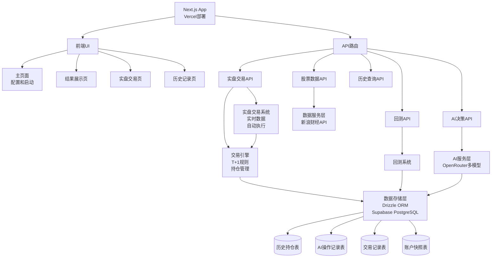

# A股

AI交易模拟平台开发计划

## 项目架构




## 技术栈

- **框架**: Next.js 16.1 (最新版本，App Router)
- **语言**: TypeScript
- **样式**: Tailwind CSS
- **图表**: ECharts (K线图)
- **数据源**: 新浪财经API
- **AI服务**: Vercel AI SDK + OpenRouter API
- **数据库**: PostgreSQL (Supabase)
- **ORM**: Drizzle ORM
- **部署**: Vercel

## 核心功能模块

### 1. 数据获取模块 (`lib/data/sina-api.ts`)

- 实现新浪财经股票数据获取
- 支持获取历史K线数据（日线、分钟线）
- 数据格式：`{date, open, high, low, close, volume}`
- 支持多股票批量获取
- 实现数据缓存机制

### 2. AI模型服务 (`lib/ai/openrouter.ts`)

- 使用 Vercel AI SDK 集成 OpenRouter
- 配置 OpenRouter provider (`@ai-sdk/openrouter`)
- 支持多模型配置（DeepSeek、Gemini、Claude等）
- 使用 `generateText` 或 `streamText` 调用模型
- 为每个模型创建独立的交易账户（10万初始资金）
- 实现AI决策接口：输入历史数据，输出买卖信号
- 结构化输出：使用 `zod` schema 定义决策输出格式

### 3. 交易引擎 (`lib/trading/engine.ts`)

- 实现T+1交易规则
- 当天买入的股票，次日才能卖出
- 做T逻辑：已有持仓才能当日卖出
- 持仓管理：记录每个模型的持仓情况
- 交易记录：保存每次买卖操作
- 盈亏计算：实时计算每个模型的收益

### 4. 回测系统 (`lib/backtest/runner.ts`)

- 支持指定时间段回测（如上上周、上月）
- 按交易日逐日模拟
- 在交易时间段（9:15-15:00）内，AI根据历史N天数据做决策
- 记录每日交易和持仓变化

### 5. 实盘交易系统 (`lib/live-trading/manager.ts`)

- 实时获取股票数据（交易时间段内）
- 自动判断交易时间段（9:15-15:00）
- 定时调用AI决策（可配置频率，如每5分钟）
- 自动执行买卖操作
- 实时更新持仓和盈亏
- 支持手动暂停/恢复实盘交易

### 6. 数据库Schema (`db/schema.ts`)

- 使用 Drizzle ORM 定义数据库表结构
- **trades 表**：交易记录
- id, model, stock, type, price, quantity, date, timestamp, created_at
- **positions 表**：历史持仓快照
- id, model, stock, quantity, buy_date, avg_price, snapshot_date, created_at
- **ai_decisions 表**：AI操作记录
- id, model, stock, decision_time, input_data (JSON), output_decision (JSON), execution_result (JSON), created_at
- **account_snapshots 表**：账户快照
- id, model, date, cash, total_value, profit, positions_data (JSON), created_at
- **live_trading_status 表**：实盘交易状态
- id, model, stock, is_active, last_decision_time, created_at, updated_at

### 7. 数据存储模块 (`lib/db/index.ts`)

- 初始化 Drizzle ORM 连接（使用 `postgres-js` 或 `pg` 连接 Supabase）
- 从 `.env.local` 读取 `DATABASE_URL` 连接字符串
- 实现数据库操作函数：
- `saveTrade()`: 保存交易记录
- `savePositionSnapshot()`: 保存持仓快照
- `saveAIDecision()`: 保存AI决策记录
- `saveAccountSnapshot()`: 保存账户快照
- `getHistoryPositions()`: 查询历史持仓
- `getAIDecisions()`: 查询AI操作记录
- `getTrades()`: 查询交易记录
- `getAccountSnapshots()`: 查询账户快照
- 实现数据查询接口：按时间范围、模型、股票查询
- 数据库迁移：使用 Drizzle Kit 管理数据库迁移

### 8. 前端页面

#### 主页面 (`app/page.tsx`)

- 模式切换：回测模式 / 实盘模式
- 股票选择器（支持多选）
- 模型选择器（多选）
- 历史数据天数设置
- 回测时间段选择（回测模式）
- 开始回测/启动实盘按钮

#### 回测结果页面 (`app/results/page.tsx`)

- 各模型盈亏对比卡片
- K线图展示（ECharts）
- 交易记录表格
- 资金曲线图
- 持仓明细

#### 实盘交易页面 (`app/live/page.tsx`)

- 实时行情展示（当前价格、涨跌幅）
- 实盘交易控制面板（启动/暂停/停止）
- 实时持仓列表（当前持仓、成本、盈亏）
- 实时盈亏统计（各模型）
- 最新交易记录（实时更新）
- AI决策日志（最近N条决策记录）

#### 历史记录页面 (`app/history/page.tsx`)

- 历史持仓查看器
- 按日期、模型、股票筛选
- 持仓变化趋势图
- AI操作记录查看器
- 决策时间线
- 决策详情（输入数据、输出决策、执行结果）
- 按模型、股票筛选
- 历史交易分析
- 交易统计（总交易次数、成功率等）
- 盈亏分析图表

### 6. API路由

#### `/api/stock/data` (`app/api/stock/data/route.ts`)

- 获取股票历史数据
- 参数：股票代码、开始日期、结束日期

#### `/api/ai/decision` (`app/api/ai/decision/route.ts`)

- 调用AI模型做交易决策
- 输入：历史数据、当前持仓、可用资金
- 输出：买卖信号（买入/卖出/持有）

#### `/api/backtest/run` (`app/api/backtest/run/route.ts`)

- 执行回测
- 参数：股票列表、模型列表、历史天数、时间段
- 返回：回测结果（交易记录、盈亏、持仓）

#### `/api/live/start` (`app/api/live/start/route.ts`)

- 启动实盘交易
- 参数：股票列表、模型列表、历史天数

#### `/api/live/status` (`app/api/live/status/route.ts`)

- 获取实盘交易状态
- 返回：各模型的实时状态、持仓、盈亏

#### `/api/live/stop` (`app/api/live/stop/route.ts`)

- 停止实盘交易

#### `/api/history/positions` (`app/api/history/positions/route.ts`)

- 查询历史持仓
- 参数：模型、股票、开始日期、结束日期

#### `/api/history/decisions` (`app/api/history/decisions/route.ts`)

- 查询AI操作记录
- 参数：模型、股票、开始日期、结束日期

#### `/api/history/trades` (`app/api/history/trades/route.ts`)

- 查询历史交易记录
- 参数：模型、股票、开始日期、结束日期

## 数据结构

### 股票数据

```typescript
interface StockData {
  code: string;      // 股票代码
  date: string;      // 日期
  open: number;      // 开盘价
  high: number;      // 最高价
  low: number;       // 最低价
  close: number;     // 收盘价
  volume: number;    // 成交量
}
```

### 交易记录

```typescript
interface Trade {
  id: string;
  model: string;     // 模型名称
  stock: string;     // 股票代码
  type: 'buy' | 'sell';
  price: number;
  quantity: number;
  date: string;
  timestamp: string; // 交易时间（分钟级）
}
```

### 持仓

```typescript
interface Position {
  stock: string;
  quantity: number;
  buyDate: string;   // 买入日期（用于T+1判断）
  avgPrice: number;  // 平均成本
}
```

### 模型账户

```typescript
interface ModelAccount {
  model: string;
  initialCapital: number;  // 10万
  currentCapital: number;   // 当前现金
  positions: Position[];   // 持仓
  trades: Trade[];         // 交易记录
  totalValue: number;      // 总资产（现金+持仓市值）
  profit: number;          // 盈亏
}
```

### AI决策记录

```typescript
interface AIDecision {
  id: string;
  model: string;
  stock: string;
  decisionTime: string;
  inputData: {
    historyData: StockData[];
    currentPositions: Position[];
    availableCapital: number;
    currentDate: string;
  };
  outputDecision: {
    action: 'buy' | 'sell' | 'hold';
    stock?: string;
    quantity?: number;
    reason: string;
  };
  executionResult: {
    executed: boolean;
    tradeId?: string;
    error?: string;
  };
}
```

## 实现细节

### T+1规则实现

- 买入时：记录买入日期，标记为"不可卖出"
- 卖出时：检查持仓买入日期，只有次日及之后才能卖出
- 做T：如果持仓是昨日或更早买入的，可以当日卖出

### AI决策提示词设计

使用 Vercel AI SDK 的 `generateText` 和结构化输出：

```typescript
import { generateText } from 'ai';
import { openrouter } from '@ai-sdk/openrouter';
import { z } from 'zod';

const decisionSchema = z.object({
  action: z.enum(['buy', 'sell', 'hold']),
  stock: z.string().optional(),
  quantity: z.number().optional(),
  reason: z.string(),
});

const prompt = `
你是一个股票交易AI，需要根据历史数据做出买卖决策。

历史数据：
{historyData}

当前状态：
- 可用资金：{capital}元
- 当前持仓：{positions}
- 当前日期：{date}

请分析历史数据，给出今日的交易决策。
注意A股T+1规则：当天买入的股票次日才能卖出。
`;

const { text, object } = await generateText({
  model: openrouter('deepseek/deepseek-chat'),
  prompt,
  schema: decisionSchema, // 结构化输出
});
```

### Drizzle ORM Schema定义示例

```typescript
// db/schema.ts
import { pgTable, text, numeric, timestamp, jsonb, boolean } from 'drizzle-orm/pg-core';

export const trades = pgTable('trades', {
  id: text('id').primaryKey(),
  model: text('model').notNull(),
  stock: text('stock').notNull(),
  type: text('type').$type<'buy' | 'sell'>().notNull(),
  price: numeric('price', { precision: 10, scale: 2 }).notNull(),
  quantity: numeric('quantity', { precision: 10, scale: 0 }).notNull(),
  date: text('date').notNull(),
  timestamp: text('timestamp').notNull(),
  createdAt: timestamp('created_at').defaultNow(),
});

export const aiDecisions = pgTable('ai_decisions', {
  id: text('id').primaryKey(),
  model: text('model').notNull(),
  stock: text('stock').notNull(),
  decisionTime: timestamp('decision_time').notNull(),
  inputData: jsonb('input_data').notNull(),
  outputDecision: jsonb('output_decision').notNull(),
  executionResult: jsonb('execution_result').notNull(),
  createdAt: timestamp('created_at').defaultNow(),
});
```

### Drizzle 连接 Supabase 示例

```typescript
// lib/db/index.ts
import { drizzle } from 'drizzle-orm/postgres-js';
import postgres from 'postgres';
import * as schema from '@/db/schema';

// 从环境变量读取连接字符串
const connectionString = process.env.DATABASE_URL!;

if (!connectionString) {
  throw new Error('DATABASE_URL is not set');
}

// 创建 postgres 客户端
const client = postgres(connectionString);

// 创建 Drizzle 实例
export const db = drizzle(client, { schema });

// drizzle.config.ts
import type { Config } from 'drizzle-kit';
import * as dotenv from 'dotenv';

dotenv.config({ path: '.env.local' });

export default {
  schema: './db/schema.ts',
  out: './db/migrations',
  driver: 'pg',
  dbCredentials: {
    connectionString: process.env.DATABASE_URL!,
  },
} satisfies Config;
```

### 新浪财经API调用

- 日线数据：`http://stock.finance.sina.com.cn/usstock/api/json.php/US_MarketDataService.getKLineData`
- 或使用：`http://hq.sinajs.cn/list=sh600000` 格式获取实时数据
- 需要处理跨域和数据格式转换

## 文件结构

```javascript
llm-cg/
├── app/
│   ├── page.tsx                 # 主页面（配置和启动）
│   ├── results/
│   │   └── page.tsx             # 回测结果展示页面
│   ├── live/
│   │   └── page.tsx             # 实盘交易页面
│   ├── history/
│   │   └── page.tsx             # 历史记录页面
│   ├── api/
│   │   ├── stock/
│   │   │   └── data/route.ts    # 股票数据API
│   │   ├── ai/
│   │   │   └── decision/route.ts # AI决策API
│   │   ├── backtest/
│   │   │   └── run/route.ts     # 回测API
│   │   ├── live/
│   │   │   ├── start/route.ts   # 启动实盘
│   │   │   ├── status/route.ts # 实盘状态
│   │   │   └── stop/route.ts   # 停止实盘
│   │   └── history/
│   │       ├── positions/route.ts # 历史持仓API
│   │       ├── decisions/route.ts # AI操作记录API
│   │       └── trades/route.ts    # 历史交易API
│   ├── actions/
│   │   └── trading.ts             # Server Actions (可选)
│   └── layout.tsx
├── lib/
│   ├── data/
│   │   └── sina-api.ts          # 新浪财经API封装
│   ├── ai/
│   │   └── openrouter.ts        # Vercel AI SDK + OpenRouter集成
│   ├── trading/
│   │   ├── engine.ts            # 交易引擎
│   │   └── rules.ts             # T+1规则实现
│   ├── backtest/
│   │   └── runner.ts            # 回测执行器
│   ├── live-trading/
│   │   └── manager.ts           # 实盘交易管理器
│   └── db/
│       ├── index.ts             # Drizzle数据库连接
│       └── queries.ts           # 数据库查询函数
├── db/
│   ├── schema.ts                # Drizzle Schema定义
│   ├── migrations/              # 数据库迁移文件
│   └── seed.ts                  # 数据库种子数据（可选）
├── drizzle.config.ts            # Drizzle配置文件
├── types/
│   └── index.ts                 # TypeScript类型定义
├── components/
│   ├── StockSelector.tsx        # 股票选择器
│   ├── ModelSelector.tsx        # 模型选择器
│   ├── KLineChart.tsx           # K线图组件
│   ├── ProfitCard.tsx           # 盈亏卡片
│   ├── TradeTable.tsx           # 交易记录表格
│   ├── LiveTradingPanel.tsx     # 实盘交易控制面板
│   └── HistoryViewer.tsx         # 历史记录查看器
├── public/
├── package.json
├── tsconfig.json
├── tailwind.config.js
└── next.config.js
```

## 环境变量

在项目根目录创建 `.env.local` 文件：

```env
# OpenRouter API
OPENROUTER_API_KEY=your_api_key

# 新浪财经API
NEXT_PUBLIC_SINA_API_BASE=https://hq.sinajs.cn

# Supabase PostgreSQL数据库连接
# 从 Supabase 项目设置中获取连接字符串
DATABASE_URL=postgresql://postgres:[YOUR-PASSWORD]@[YOUR-PROJECT-REF].supabase.co:5432/postgres
```

**获取 Supabase 连接字符串的步骤：**

1. 登录 Supabase Dashboard
2. 选择项目
3. 进入 Settings > Database
4. 在 "Connection string" 部分选择 "URI" 格式
5. 复制连接字符串，替换 `[YOUR-PASSWORD]` 为实际密码
6. 将连接字符串添加到 `.env.local` 文件的 `DATABASE_URL` 变量中

## 开发步骤

1. **项目初始化**

- 使用最新版本创建Next.js项目：
  ```bash
    npx create-next-app@latest llm-cg
  ```

选择配置：

- TypeScript: Yes
- ESLint: Yes
- Tailwind CSS: Yes
- `src/` directory: Yes (推荐)
- App Router: Yes (默认)
- Import alias: `@/*` (默认)
- 配置TypeScript和Tailwind CSS（已自动配置）
- 安装核心依赖：
- `ai` (Vercel AI SDK)
- `@ai-sdk/openrouter` (OpenRouter provider)
- `drizzle-orm` 和 `postgres` 或 `pg` (Supabase PostgreSQL连接)
- `drizzle-kit` (数据库迁移工具)
- `echarts` 和 `echarts-for-react` (图表)
- `axios` (HTTP请求)
- `zod` (数据验证和AI结构化输出)

1. **数据库设置**

- 在 Supabase 创建项目并获取数据库连接字符串
- 创建 `.env.local` 文件，配置 `DATABASE_URL`
- 配置 Drizzle ORM 连接 Supabase
- 定义数据库Schema（trades, positions, ai_decisions, account_snapshots, live_trading_status）
- 创建初始迁移文件
- 实现数据库连接和查询函数
- 配置 `drizzle.config.ts` 使用 Supabase 连接字符串

1. **数据获取模块**

- 实现新浪财经API调用
- 处理数据格式转换
- 添加错误处理和重试机制
- 实现数据缓存（可选）

1. **AI服务集成**

- 使用Vercel AI SDK配置OpenRouter provider
- 实现多模型调用接口（DeepSeek, Gemini, Claude等）
- 使用zod定义AI决策输出schema（结构化输出）
- 设计AI决策提示词模板
- 实现决策解析和执行逻辑

1. **交易引擎开发**

- 实现T+1规则逻辑
- 持仓管理
- 交易执行和记录
- 盈亏计算
- 集成数据库存储（保存交易记录）

1. **回测系统**

- 实现时间序列回测
- 按交易日逐日模拟
- 在交易时间段内调用AI决策
- 保存回测结果到数据库

1. **实盘交易系统**

- 实现实时数据获取
- 交易时间段判断（9:15-15:00）
- 定时任务（使用Vercel Cron或Next.js API routes）
- 自动执行AI决策
- 实时更新数据库

1. **前端开发**

- 主页面UI（模式切换、股票选择、模型选择、参数配置）
- 回测结果展示页面（K线图、盈亏对比、交易记录）
- 实盘交易页面（实时行情、控制面板、实时持仓）
- 历史记录页面（历史持仓、AI操作记录、交易分析）
- 响应式设计

1. **API路由开发**

- 股票数据API
- AI决策API
- 回测执行API
- 实盘交易API（启动、状态、停止）
- 历史数据查询API（持仓、决策、交易）

1. **测试和优化**

- 单元测试（交易引擎、T+1规则）
- 集成测试（AI决策、数据库操作）
- 性能优化（数据库查询优化、API响应优化）

1. **部署到Vercel**

- 在 Vercel 项目设置中配置环境变量：
- `OPENROUTER_API_KEY`
- `DATABASE_URL` (Supabase 连接字符串)
- `NEXT_PUBLIC_SINA_API_BASE`
- 配置Vercel Cron Jobs（实盘交易定时任务）
- 运行数据库迁移（在本地或通过 Supabase SQL Editor）
- 部署配置
- 域名设置

**注意**：`.env.local` 文件仅用于本地开发，不要提交到 Git。生产环境的环境变量需要在 Vercel Dashboard 中配置。

## 注意事项

1. **Next.js 16.1 新特性**：

- 使用 React Server Components 作为默认，减少客户端 JavaScript
- 优先使用 Server Actions 处理表单和数据变更
- 利用 Partial Prerendering (PPR) 提升性能
- 使用 `useFormStatus` 和 `useFormState` 处理表单状态
- 使用 `loading.tsx` 和 `error.tsx` 处理加载和错误状态
- 利用 Streaming 和 Suspense 优化用户体验

1. **API限制**：新浪财经API可能有频率限制，需要实现请求队列和缓存
2. **数据准确性**：验证获取的数据格式和完整性
3. **T+1规则**：严格实现T+1逻辑，包括做T的情况
4. **错误处理**：网络错误、API错误、数据异常等情况的处理
5. **性能优化**：

- 大量数据回测时的性能考虑
- 使用 Next.js 16.1 的 Streaming 和 Suspense
- 合理使用 `loading.tsx` 和 `error.tsx`
- 利用 React Server Components 减少客户端 JavaScript 体积

1. **数据库优化**：合理使用索引，优化查询性能，考虑分页查询
2. **实盘交易定时任务**：使用Vercel Cron Jobs实现定时执行，注意时区设置
3. **AI结构化输出**：使用zod schema确保AI输出格式正确，处理解析错误
4. **数据库迁移**：使用Drizzle Kit管理数据库迁移，确保生产环境数据一致性
5. **类型安全**：充分利用 TypeScript 和 Next.js 的类型推断，确保类型安全

